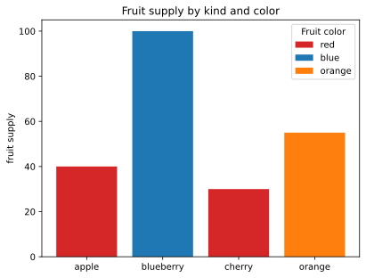

```python
a = 1
b = 2
print(a, b)
```

    1 2
    


```python
c = a+b
print(c)
```

    3
    


```python
import matplotlib.pyplot as plt
%config InlineBackend.figure_format = 'svg'

fig, ax = plt.subplots()

fruits = ['apple', 'blueberry', 'cherry', 'orange']
counts = [40, 100, 30, 55]
bar_labels = ['red', 'blue', '_red', 'orange']
bar_colors = ['tab:red', 'tab:blue', 'tab:red', 'tab:orange']

ax.bar(fruits, counts, label=bar_labels, color=bar_colors)

ax.set_ylabel('fruit supply')
ax.set_title('Fruit supply by kind and color')
ax.legend(title='Fruit color')

plt.show()
```


    

    


# Caption 1

## Caption 1.1

### Caption 1.1.1

#### Caption 1.1.1.1

This is a markdown block.


```python
from IPython.display import Image

Image(url="https://upload.wikimedia.org/wikipedia/commons/9/94/Animation_Sieve_of_Eratosth.gif?20061230143851")
```


Above GIF is abtained from Wikipedia entry "[Sieve of Eratosthenes](https://en.wikipedia.org/wiki/Sieve_of_Eratosthenes)" to show Sieve of Eratosthenes for finding all prime numbers up to any given limit.
